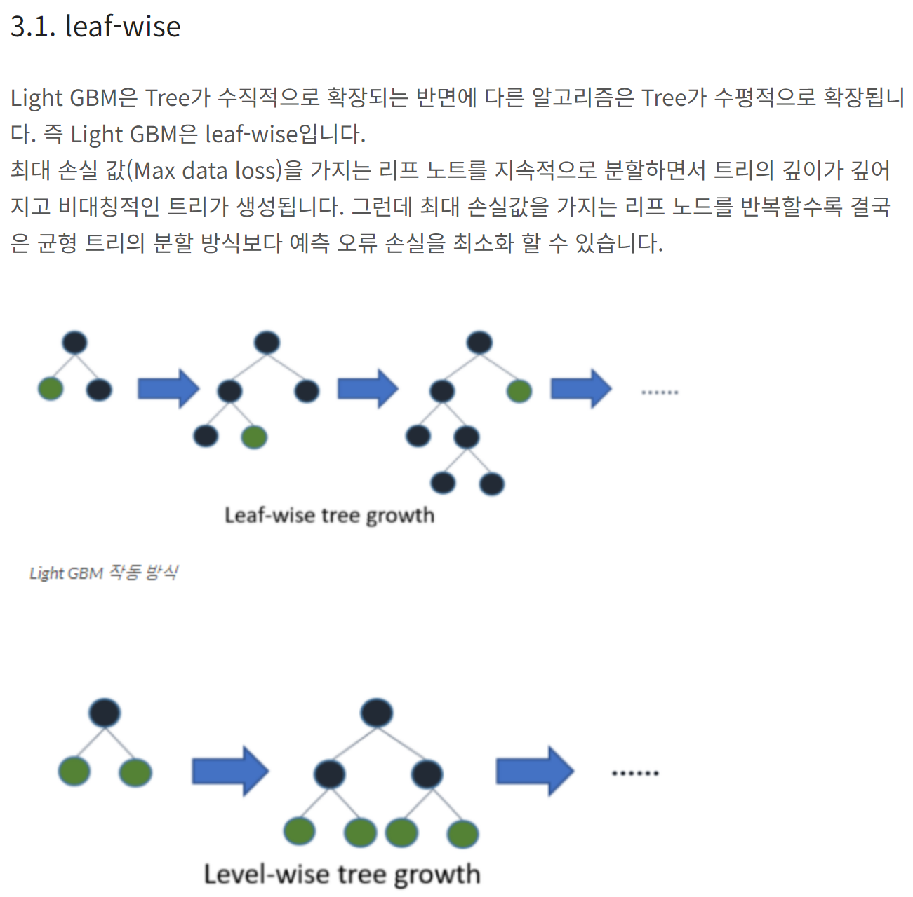

# 사전 조사 : 기술적 요소

> 정형데이터를 통한 머신러닝 모델을 개발  
> 제시된 기술 : Multiple Regression, Random Forest, LightGBM

## 1. Multiple Regression

### 1.1. 개요

1. Multiple Regression = 다중회귀분석  
2. 2개 이상의 독립변수가 종속변수와 인과관계 혹은 상관 관계를 가지는 것
3. 

### 1.2 개념

- `다중회귀분석` : 독립변수가 2개 이상인 회귀분석
- `회귀분석` : 독립변수와 종속변수 사이의 관계를 모델링하는 통계적 방법
- `독립변수` : 결과에 영향을 미치는 변수
- `종속변수` : 결과를 나타내는 변수
- `회귀계수` : 독립변수가 종속변수에 미치는 영향을 나타내는 값
- `회귀식` : 종속변수와 독립변수 사이의 관계를 나타내는 식
- `다중공선성` : 독립변수들 간에 강한 상관관계가 있는 경우
   - 독립변수들 간의 상관관계가 높으면 회귀계수 추정이 어려워짐
   - VIF(분산팽창요인)을 통해 다중공선성을 확인
- `VIF` : 다중공선성을 확인하는 지표
- `잔차` : 실제값과 예측값의 차이
- `잔차분석` : 잔차의 분포를 확인하여 모델의 적합성을 평가
- `R^2` : 회귀모델의 설명력을 나타내는 지표
- `Adjusted R^2` : 독립변수의 수를 고려한 R^2
- `F-통계량` : 회귀모델의 유의성을 판단하는 지표
- `회귀진단` : 회귀모델의 가정을 확인하는 과정

### 1.2 예시
```python
import pandas as pd
import numpy as np
from sklearn.model_selection import train_test_split
from sklearn.linear_model import LinearRegression
from sklearn.metrics import mean_squared_error

# 데이터 불러오기
data = pd.read_csv('data.csv')

# 독립변수, 종속변수 분리
X = data.drop('target', axis=1)
y = data['target']

# 학습 데이터, 테스트 데이터 분리
X_train, X_test, y_train, y_test = train_test_split(X, y, test_size=0.2, random_state=42)

# 모델 학습
model = LinearRegression()
model.fit(X_train, y_train)

# 예측
y_pred = model.predict(X_test)

# 평가
score = model.score(X_test, y_test)     # R^2
mse = mean_squared_error(y_test, y_pred)
print(mse)

# 회귀계수 확인
print(model.coef_)
print(model.intercept_)

# 회귀진단
residual = y_test - y_pred
plt.scatter(y_pred, residual)
plt.axhline(y=0, color='r', linestyle='--')
plt.show()

# VIF 확인 (다중공선성)
from statsmodels.stats.outliers_influence import variance_inflation_factor

vif = pd.DataFrame()
vif['VIF Factor'] = [variance_inflation_factor(X.values, i) for i in range(X.shape[1])]
vif['features'] = X.columns
print(vif)

# 잔차분석
import seaborn as sns

sns.histplot(residual, kde=True)
plt.show()

# 임의의 데이터로 예측
new_data = pd.DataFrame({'feature1': [1, 2, 3], 'feature2': [4, 5, 6]})
new_pred = model.predict(new_data)
print(new_pred)
```

### 1.3. 장단점
#### 장점
1. 활용이 쉽고 직관적, 빠른 계산
2. 계수의 해석이 용이
3. 다중회귀분석은 변수 간의 관계를 파악할 수 있음
4. 각 변수의 중요도를 파악할 수 있음

#### 단점
1. 다중공선성 문제
2. 이상치에 민감
3. 선형성 가정 - 비선형적인 관계를 설명엔 어려움
4. 변수 선택의 어려움 - 변수가 많을 경우 변수 선택이 어려움
5. 오차항의 독립성 가정 - 오차항이 독립적이지 않을 경우 문제 발생
> = 변수(데이터) 전처리 및 선별이 중요

### 1.4 예시

https://www.kaggle.com/code/swekerr/multiplelr-student-performance

## 2. Random Forest
### 2.1 의사결정나무
1. 의사결정나무 = Decision Tree
2. 의사결정나무는 데이터를 분할하여 분류 및 회귀를 수행하는 모델
3. 데이터를 분할하여 정보획득량을 최대화하는 방향으로 분할
4. 과적합 문제가 발생할 수 있음
5. 앙상블 기법을 통해 과적합 문제를 해결
6. = Random Forest

### 2.2 Random Forest
1. 의사결정나무를 여러 개 만들어 그 결과를 종합하는 방법
2. 각 트리는 독립적으로 학습
3. Bagging을 통해 트리를 만들고, 각 트리의 결과를 종합
4. 과적합 문제를 해결하고, 예측 성능을 향상
5. Random Forest는 분류, 회귀, 이상치 탐지 등에 활용
6. 특징
   - 다양한 데이터 타입을 다룰 수 있음
   - 과적합 문제를 해결
   - 변수 중요도를 계산할 수 있음
   - 랜덤성을 통해 다양한 모델을 생성
   - 병렬처리가 가능
   - 결정 경계를 생성하여 시각화 가능
   - 하이퍼파라미터 튜닝이 필요
   - 트리의 개수가 많을수록 성능이 향상

### 2.3 예시
```python
import pandas as pd
import numpy as np
from sklearn.model_selection import train_test_split
from sklearn.ensemble import RandomForestRegressor
from sklearn.metrics import mean_squared_error

# 데이터 불러오기
data = pd.read_csv('data.csv')

# 독립변수, 종속변수 분리
X = data.drop('target', axis=1)
y = data['target']

# 학습 데이터, 테스트 데이터 분리
X_train, X_test, y_train, y_test = train_test_split(X, y, test_size=0.2, random_state=42)

# 모델 학습
model = RandomForestRegressor()
model.fit(X_train, y_train)

# 예측
y_pred = model.predict(X_test)

# 평가
mse = mean_squared_error(y_test, y_pred)
print(mse)

# 변수 중요도 확인
importances = model.feature_importances_
indices = np.argsort(importances)[::-1]
features = X.columns

plt.bar(range(X.shape[1]), importances[indices])
plt.xticks(range(X.shape[1]), [features[i] for i in indices], rotation=90)
plt.show()

# 임의의 데이터로 예측
new_data = pd.DataFrame({'feature1': [1, 2, 3], 'feature2': [4, 5, 6]})
new_pred = model.predict(new_data)
print(new_pred)
```

### 2.4 장단점
#### 장점
1. 과적합 문제 해결
2. 다양한 데이터 타입 다룰 수 있음
3. 변수 중요도 계산 가능
4. 랜덤성을 통해 다양한 모델 생성
5. 병렬처리 가능
6. 결정 경계 생성하여 시각화 가능
7. 성능이 높음
8. 이상치 탐지 가능

#### 단점
1. 하이퍼파라미터 튜닝이 필요
2. 트리의 개수가 많을수록 성능이 향상되지만 시간이 **오래 걸림**
3. 트리의 개수가 많을수록 모델이 복잡해짐
4. 트리의 개수가 많을수록 메모리 사용량이 증가
5. 트리의 개수가 많을수록 **해석이 어려움**
6. 트리의 개수가 많을수록 **과적합 문제** 발생 가능

## 3. LightGBM

### 3.1 개요

LightGBM은 `Gradient Boosting` 기반의 모델

### 3.2 'Gradient Boosting' 개념
1. Gradient Boosting은 약한 학습기를 여러 개 연결하여 강한 학습기를 만드는 앙상블 기법
2. 이전 트리의 오차를 보완하는 방향으로 새로운 트리를 생성

### 3.3 LightGBM 특징
1. `Leaf-wise`
   1. 트리의 깊이를 줄이고, 리프 노드를 분할하여 속도를 향상
   2. 균형 트리 분할 방식보다 정확도가 높음
   3. 오차를 줄이는 노드를 생성하는 방식

2. 속도 빠름, 메모리 사용량 적음
3. 고차원 데이터에 적합 : 범주형 변수를 자동으로 변환, 최적 분할
4. 정확도 높음 : Gradient Boosting + Leaf-wise
5. GPU 지원 : 학습 속도 향상

### 3.4 예시
```python
import pandas as pd
import numpy as np
from sklearn.model_selection import train_test_split
from lightgbm import LGBMRegressor
from sklearn.metrics import mean_squared_error

# 데이터 불러오기
data = pd.read_csv('data.csv')

# 독립변수, 종속변수 분리
X = data.drop('target', axis=1)
y = data['target']

# 학습 데이터, 테스트 데이터 분리
X_train, X_test, y_train, y_test = train_test_split(X, y, test_size=0.2, random_state=42)

# 모델 학습
model = LGBMRegressor(n_estimators=1000, learning_rate=0.01)
model.fit(
   X_train, 
   y_train, 
   eval_set=[(X_test, y_test)], # eval_set : 검증 데이터
   early_stopping_rounds=100,   # early_stopping_rounds : 과적합 방지
   verbose=100
   ) 

# 평가
score = roc_auc_score(y_test, grid.predict_proba(X_test)[:, 1], average='macro')
print(score)
```

### 3.5 장단점
#### 장점
1. 속도가 빠름
2. 메모리 사용량이 적음
3. 고차원 데이터에 적합
4. 정확도가 높음
5. GPU 지원
6. 과적합 문제 해결
7. 변수 중요도 계산 가능
8. 랜덤성을 통해 다양한 모델 생성
9. 병렬처리 가능

### 기타 메모

- 현길좌 : catboost같은 최신 모델도 있다