# 5월 16일 모델링 중간 점검

### 순서

1. 데이터 전처리
2. 모델링
3. 결과 확인
4. 데이터 수정

## 1. 데이터 전처리
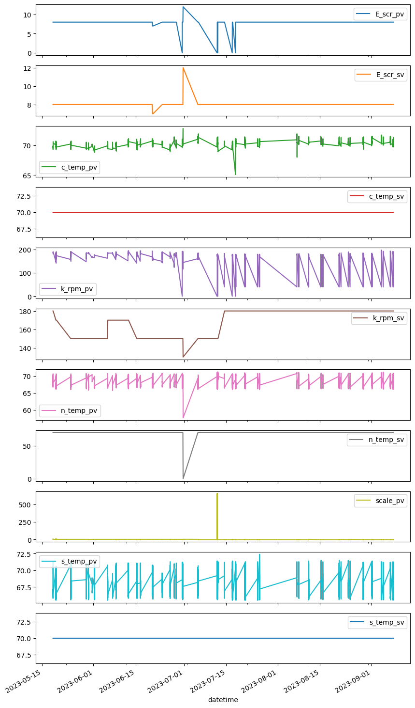

### 타깃 범위 설정

- 이상치로 보이는 값을 제거한다
- 세 그래프를 보여주는 `box_hist()`함수 생성

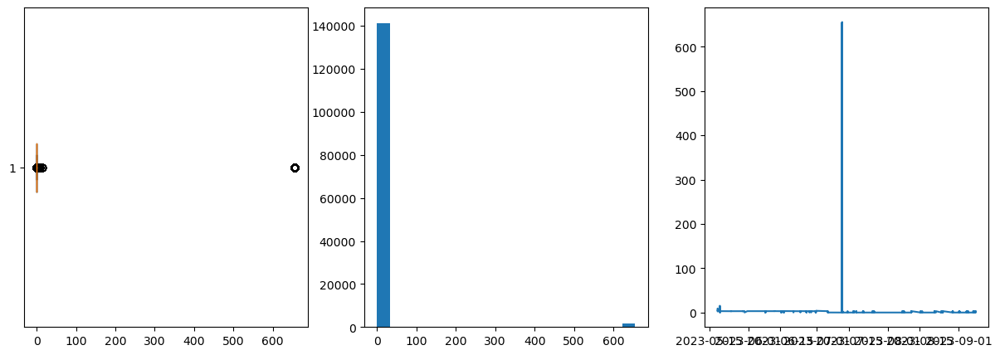  
: 전처리 없는 초기 데이터 - 유독 튀는 이상치 제거

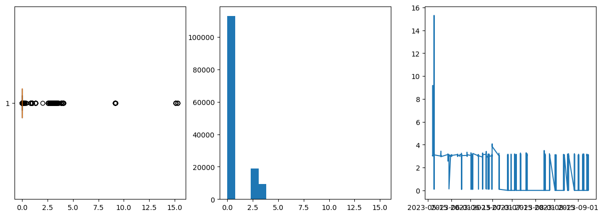  
: 대부분 100이하이므로 100이상 값 제거

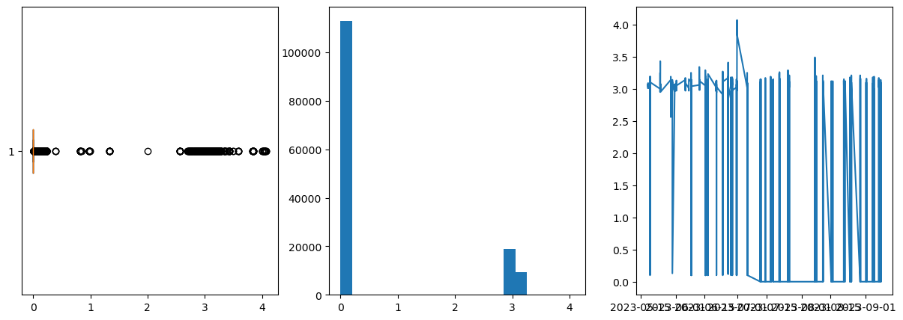  
: 5이하로 나타나므로 5이하 값 제거 - 0에 가까운 값이 대부분이다

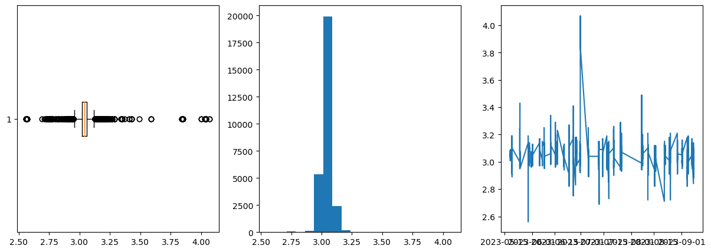  
: 2 이하의 값을 이상치로 판단 - 28,167개 남음

```python
# 3.6 이상의 데이터가 거의 없음
print('전체 데이터 개수 :', len(data))
print('3.6 이상의 데이터 개수 :', len(data[data['scale_pv'] > 3.6]))
===============================================
전체 데이터 개수 : 28167
3.6 이상의 데이터 개수 : 43
```

`총 인스턴스 수 : 28124`

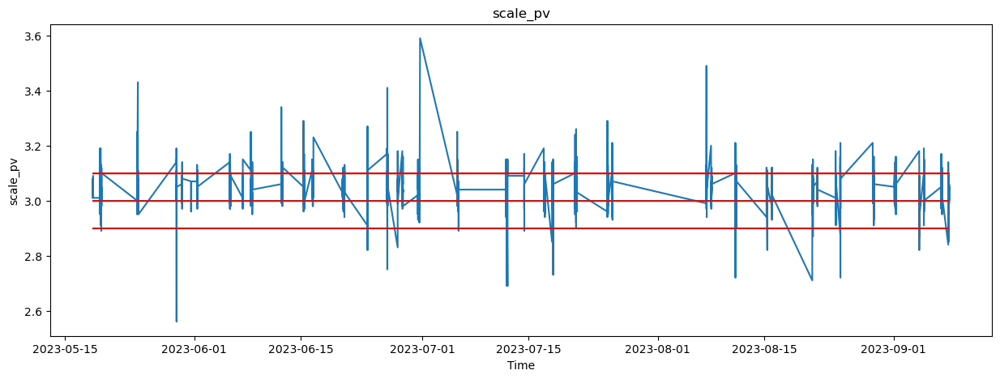  
: 최종 스케일 범위

### 데이터 인덱스 수정

- 사실 앞서 전처리하며 datetime 대신 인덱스로 했을 땐 아래와 같은 그래프를 보였다.

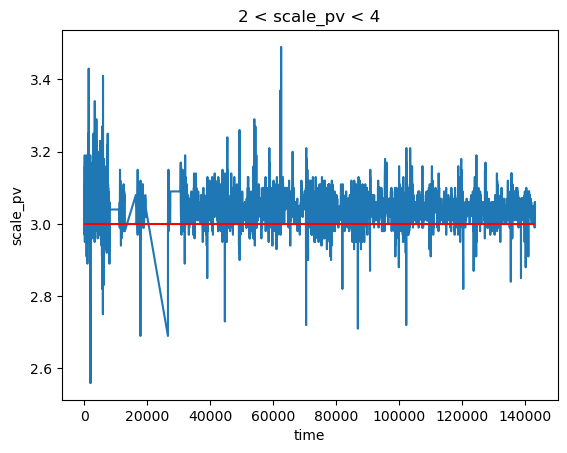

- 14만개의 데이터 중 2만8천개만 남고, 날짜가 불연속적이므로 datetime 대신 순서 인덱스로 그래프 표현
- 이로 인해 날짜 값은 데이터에 미포함 : 대신 weekdays 등으로 대체하면 더 유의미할 것으로 판단

```python
data['weekday'].value_counts()
===============================================
weekday
4    11183      # 금요일이 젤 많넹
1     5702
0     4562
3     3966
2     2625
6       86      # 토요일도 일부 있다
Name: count, dtype: int64
```
- 문득 궁금해서 원본 파일의 요일 비교도 해보았다.
```python
# 문득 궁금해져서: 원본에서 weekday 비교
data_original = pd.read_csv('../DATA/바웰공정데이터.csv')
data_original['time'] = pd.to_datetime(data_original['time'])
data_original['weekday'] = data_original['time'].dt.weekday
data_original['weekday'].value_counts()
===============================================
weekday
4    39023      # 놀랍게도 동일한 순서
1    37054      # 그렇지만 화요일 데이터도 비슷하게 많다
0    25526
2    24655
3    15670
6     1163
Name: count, dtype: int64
```

### sv 값 확인

- sv 값은 변동폭이 작으므로 먼저 분석해봄

```python
E_scr_sv            # % 확인
8     27595         # 98%
7       524         # 1.8%
12        5         # 0.02%
Name: count, dtype: int64

c_temp_sv           # 변동 없음
70    28124     
Name: count, dtype: int64

k_rpm_sv
180    21187        # 75%
150     4888        # 17%
170     2044        # 7%
130        5        # 0.02%
Name: count, dtype: int64

n_temp_sv
70    28119         # 99.98%
0         5
Name: count, dtype: int64

s_temp_sv           # 변동 없음
70    28124
Name: count, dtype: int64
```

> 분석 : sv를 반영하는 데엔 rpm, 그나마 scr이 유의미한 것으로 판단

- rpm 비교

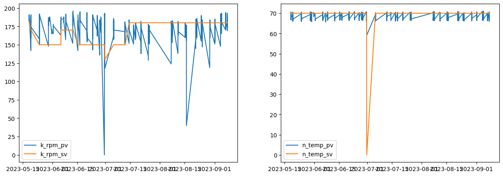  


### dev, diff 컬럼 생성

```python
# 3-1. deviation
data['scr_dv'] = data['E_scr_sv'] - data['E_scr_pv']
data['ctemp_dv'] = data['c_temp_sv'] - data['c_temp_pv']
data['rpm_dv'] = data['k_rpm_sv'] - data['k_rpm_pv']
data['ntemp_dv'] = data['n_temp_sv'] - data['n_temp_pv']
data['stemp_dv'] = data['s_temp_sv'] - data['s_temp_pv']
```

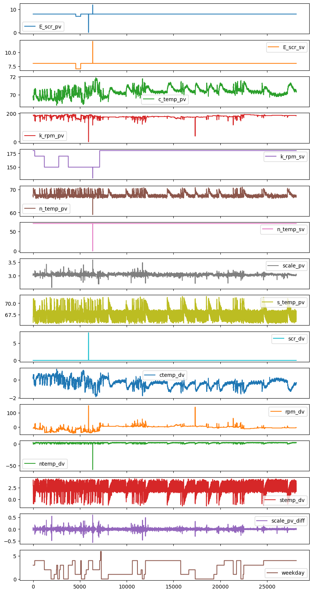

- c_temp sv,  s_temp_sv 는 제거

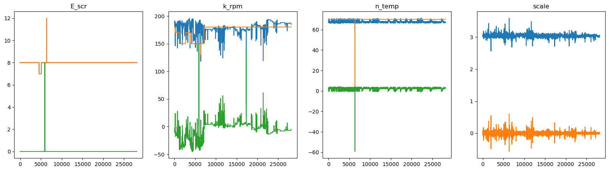  
: 관련 변수끼리 묶음

#### 분석

1. E_scr은 pv와 sv가 거의 일치, 한 두 데이터 확인
2. k_rpm이 가장 의미가 있어보이는데, 일정부분 100을 넘기는 것을 보아 sv가 0이 되는 것이라 예상
3. n_temp도 0에 가깝지만 변화량이 있어 의미 있을 거라 판단
4. scale의 변화량은 있는데, 단순 변화량은 일자별 차이가 나므로 스케일링이 더 나을 거라 판단됨

## 중간 점검
```python
Multiple Linear Regression
coef : [ 7.97232923e+09 -7.97232923e+09  1.38964754e+10  1.62237782e+09
 -1.62237782e+09  1.55292264e+09 -1.55292264e+09  3.20831262e+09
  7.97232923e+09  1.38964754e+10  1.62237782e+09  1.55292264e+09
  3.20831262e+09  4.83414944e-01 -1.05601549e-03]
MAE: 0.0259
MAPE: 0.0085
MSE: 0.0015
RMSE: 0.0383
R2 Score: 0.1524

Random Forest
MAE: 0.0193
MAPE: 0.0063
MSE: 0.0009
RMSE: 0.0305
R2 Score: 0.4650

[LightGBM] [Info] Auto-choosing row-wise multi-threading, the overhead of testing was 0.000521 seconds.
You can set `force_row_wise=true` to remove the overhead.
And if memory is not enough, you can set `force_col_wise=true`.
[LightGBM] [Info] Total Bins 530
[LightGBM] [Info] Number of data points in the train set: 22499, number of used features: 13
[LightGBM] [Info] Start training from score 3.041821
LightGBM
MAE: 0.0227
MAPE: 0.0075
MSE: 0.0011
RMSE: 0.0327
R2 Score: 0.3848
```

## GridSearchCV

- 30분 51초 동안 돌았지만 결국 값은 같았다 ㅎ... 오히려 못해

```python
Random Forest Tuning
Best Parameters: {'max_depth': 100, 'min_samples_leaf': 1, 'min_samples_split': 2, 'n_estimators': 100}
MAE: 0.0193
MAPE: 0.0063
MSE: 0.0009
RMSE: 0.0305
R2 Score: 0.4648
```

## 하나 씩 열어보기

[ㅇ] 4가지 이상치 제거하기
[ㅇ] 컬럼 골라내기
[ㅇ] scaler 적용하기

추가 고려사항
[ㅇ] n_temp_sv 0인 값 제거

#### 1. E_scr

```python
# 1. E_scr의 dv가 0이 아닌 값
data[data['scr_dv'] != 0]       # pv가 0
```

- pv 가 0인게 총 19개
- scale이 3.0대라 일단 보류

#### 2. rpm

- 위 19개 자료와 거의 동일!

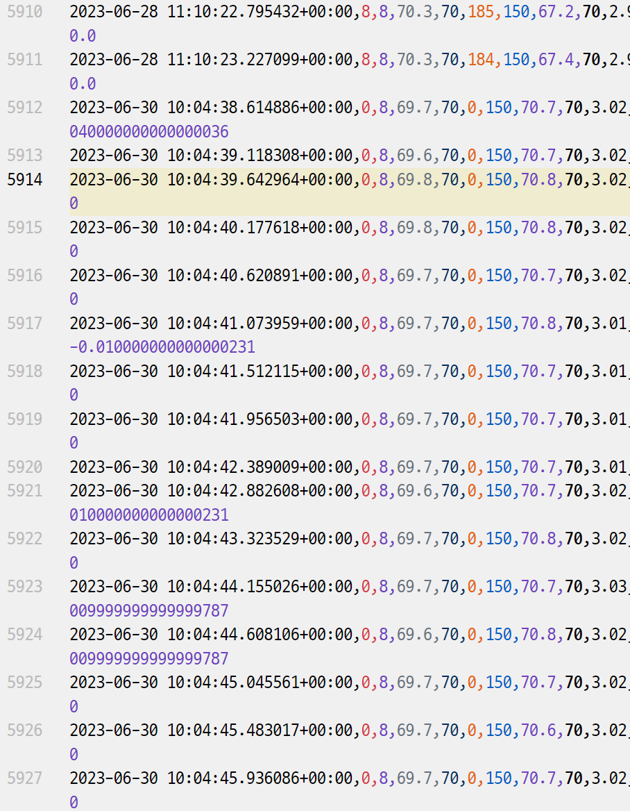  
: 시간대는 9초 사이 - 센서 오류 or 전원 off?

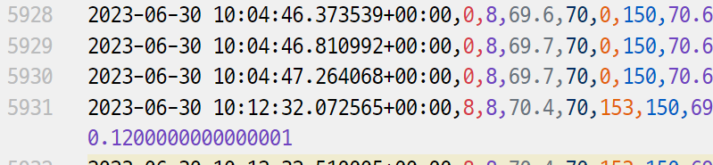  
: 0되고 8분 후 다시 작업

> 1번에서 이상치 제거되므로 dv 컬럼 외 지우기만 하기

#### 3. n_temp

- 사실상 전처리하기 제일 좋은 친구
- 가장 일정한 범위에서 움직이고 극소수의 이상치만 존재
- 0 값일 때 일정하므로 일단 제거하지 않음

#### 4. scale

- diff 제거

#### 기타

- c_temp, s_temp sv 제거

### 거의 최종 전처리

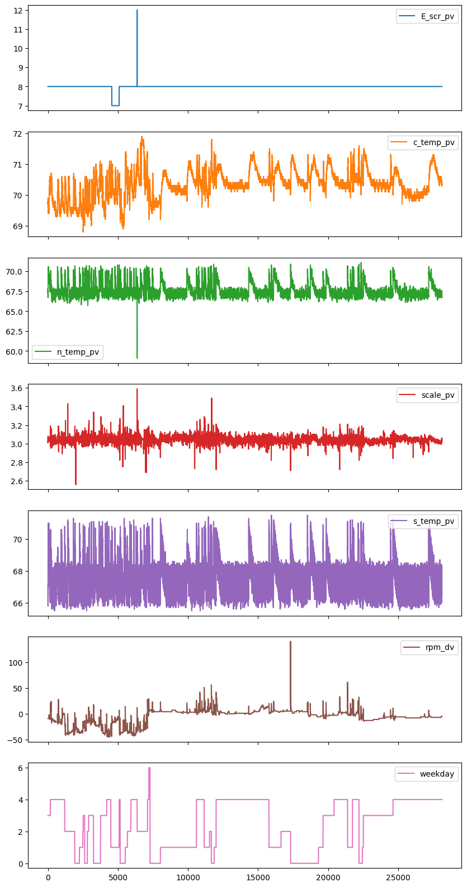  
: 7개 컬럼으로 줄임, 이상치 하나씩 확인

- 각 컬럼의 이상치를 확인한다

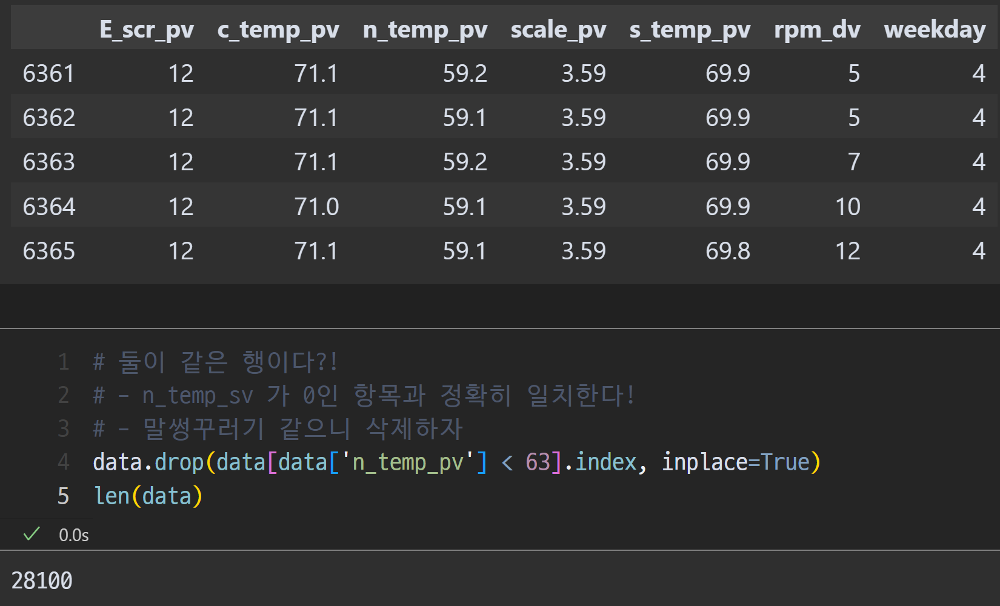  
: 놀랍게도 n_temp_sv가 0이었던 5개 행에서만 이상치가 발견됨

- E_scr_pv, n_temp_pv 에서 다 같은 이상치 (scale도 3.5대)
- 삭제한다!

## MO4 전처리 완료

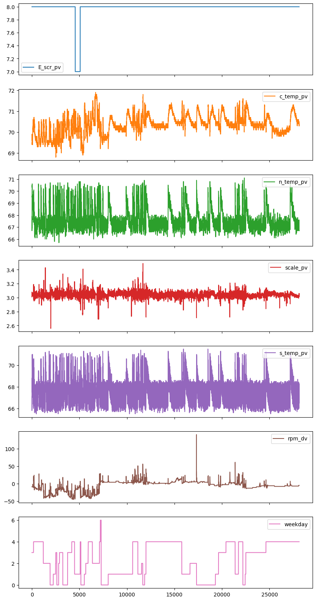  
: 최최종 전처리

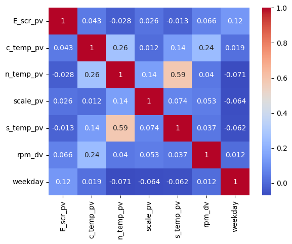  
: 단순 상관계수에선 scale엔 다 바닥이다...

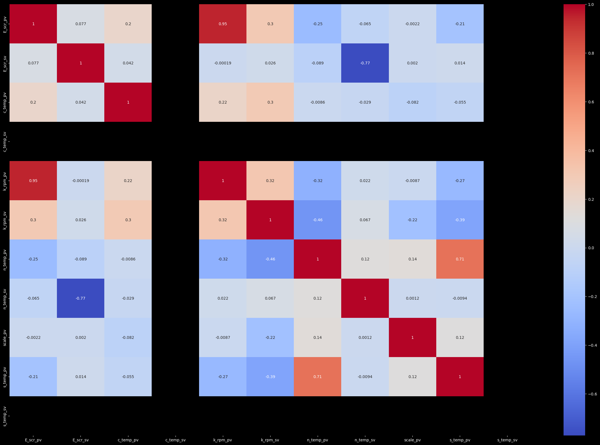  
: 초기 데이터 히트맵

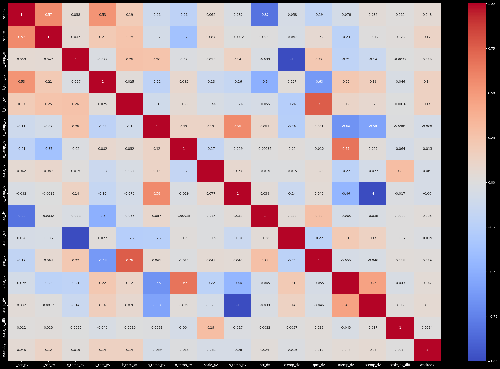  
: scale 정제한 데이터의 히트맵 - 여기서도 scale은 다 바닥

### 모델링

#### 1. Scaler 없이

```python
Multiple Linear Regression
coef : [ 0.00940639 -0.00304878  0.00679727 -0.00077587  0.00016171 -0.00145634]
MAE: 0.0273
MAPE: 0.0090
MSE: 0.0016
RMSE: 0.0403
R2 Score: 0.0440

Random Forest
MAE: 0.0180
MAPE: 0.0059
MSE: 0.0008
RMSE: 0.0280
R2 Score: 0.5381

[LightGBM] [Info] Auto-choosing row-wise multi-threading, the overhead of testing was 0.000148 seconds.
You can set `force_row_wise=true` to remove the overhead.
And if memory is not enough, you can set `force_col_wise=true`.
[LightGBM] [Info] Total Bins 246
[LightGBM] [Info] Number of data points in the train set: 22480, number of used features: 6
[LightGBM] [Info] Start training from score 3.041669
LightGBM
MAE: 0.0236
MAPE: 0.0078
MSE: 0.0011
RMSE: 0.0338
R2 Score: 0.3254
```

#### 2. Scaler 적용

- MinMaxScaler 적용

```python
Multiple Linear Regression
coef : [ 0.0101144  -0.01016259  0.03946804 -0.00500562  0.03216844 -0.00939574]
MAE: 0.0294
MAPE: 0.0578
MSE: 0.0019
RMSE: 0.0433
R2 Score: 0.0440

Random Forest
MAE: 0.0192
MAPE: 0.0376
MSE: 0.0009
RMSE: 0.0296
R2 Score: 0.5539

[LightGBM] [Info] Auto-choosing col-wise multi-threading, the overhead of testing was 0.000529 seconds.
You can set `force_col_wise=true` to remove the overhead.
[LightGBM] [Info] Total Bins 242
[LightGBM] [Info] Number of data points in the train set: 22480, number of used features: 6
[LightGBM] [Info] Start training from score 0.517924
LightGBM
MAE: 0.0254
MAPE: 0.0497
MSE: 0.0013
RMSE: 0.0364
R2 Score: 0.3254
```

> 최종 결과 : Random Forest 0.5539가 최대

## Scaler 변경

### StandardScaler 적용

```python
Multiple Linear Regression
coef : [ 0.03046822 -0.03423144  0.14908841 -0.0209167   0.05412258 -0.05463139]
MAE: 0.6539
MAPE: 1.1367
MSE: 0.9309
RMSE: 0.9648
R2 Score: 0.0440

Random Forest
MAE: 0.4277
MAPE: 1.3662
MSE: 0.4353
RMSE: 0.6597
R2 Score: 0.5530

[LightGBM] [Info] Auto-choosing col-wise multi-threading, the overhead of testing was 0.000521 seconds.
You can set `force_col_wise=true` to remove the overhead.
[LightGBM] [Info] Total Bins 248
[LightGBM] [Info] Number of data points in the train set: 22480, number of used features: 6
[LightGBM] [Info] Start training from score -0.007115
LightGBM
MAE: 0.5661
MAPE: 1.2688
MSE: 0.6569
RMSE: 0.8105
R2 Score: 0.3254
```

- R2는 조금 느는데 MAE가 더 낮아짐

### 단순 Normalizer

```python
Multiple Linear Regression
coef : [ 4.68547973e-02  2.72079311e-02  7.62536252e-03  6.11223146e-04
  2.55797441e-05 -1.60353416e-03]
MAE: 0.0003
MAPE: 0.0100
MSE: 0.0000
RMSE: 0.0004
R2 Score: 0.5763

Random Forest
MAE: 0.0002
MAPE: 0.0064
MSE: 0.0000
RMSE: 0.0003
R2 Score: 0.7933

[LightGBM] [Info] Auto-choosing col-wise multi-threading, the overhead of testing was 0.000449 seconds.
You can set `force_col_wise=true` to remove the overhead.
[LightGBM] [Info] Total Bins 1530
[LightGBM] [Info] Number of data points in the train set: 22480, number of used features: 6
[LightGBM] [Info] Start training from score 0.025376
LightGBM
MAE: 0.0002
MAPE: 0.0080
MSE: 0.0000
RMSE: 0.0003
R2 Score: 0.7020
```

- ?? 제일 좋아보이는데?
- 하지만 Normalizer는 각 행 별로 정규화

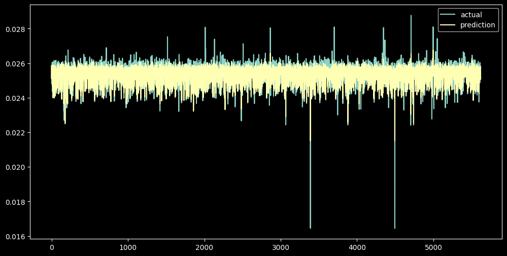  
: 이게 좋은 건지 모르겠다... scale 값이 원래 형태와 다르다

### RobustScaler

```python
Multiple Linear Regression
coef : [ 0.2351598  -0.04573164  0.15293866 -0.03491419  0.06064185 -0.10922546]
MAE: 0.6827
MAPE: 62957052648449.8438
MSE: 1.0148
RMSE: 1.0074
R2 Score: 0.0440

Random Forest
MAE: 0.4476
MAPE: 158053967887223.5625
MSE: 0.4764
RMSE: 0.6902
R2 Score: 0.5512

[LightGBM] [Info] Auto-choosing row-wise multi-threading, the overhead of testing was 0.000184 seconds.
You can set `force_row_wise=true` to remove the overhead.
And if memory is not enough, you can set `force_col_wise=true`.
[LightGBM] [Info] Total Bins 242
[LightGBM] [Info] Number of data points in the train set: 22480, number of used features: 6
[LightGBM] [Info] Start training from score 0.041726
LightGBM
MAE: 0.5911
MAPE: 110001817389071.1719
MSE: 0.7161
RMSE: 0.8462
R2 Score: 0.3254
```

- RobustScaler는 이상치에 덜 민감하게 스케일링
- 꽤 좋은 결과를 보임 (0.5512, StandardScaler보다는 낮음)

### 최종 결과

- Normalizer가 가장 좋아보이지만, scale 값이 원래 형태와 달라 사용하면 안될 것 같다
- 각 결과를 표로 정리

#### MAE
| Scaler | MLR | RF | LGBM |
| --- | --- | --- | --- |
| None | 0.0273 | 0.0180 | 0.0236 |
| MinMaxScaler | 0.0294 | 0.0192 | 0.0254 |
| StandardScaler | 0.6539 | 0.4277 | 0.5661 |
| Normalizer | 0.0003 | 0.0002 | 0.0002 |
| RobustScaler | 0.6827 | 0.4476 | 0.5911 |

#### MAPE
| Scaler | MLR | RF | LGBM |
| --- | --- | --- | --- |
| None | 0.0090 | 0.0059 | 0.0078 |
| MinMaxScaler | 0.0578 | 0.0376 | 0.0497 |
| StandardScaler | 1.1367 | 1.3662 | 1.2688 |
| Normalizer | 0.0100 | 0.0064 | 0.0080 |

#### R2 Score
| Scaler | MLR | RF | LGBM |
| --- | --- | --- | --- |
| None | 0.0440 | 0.5381 | 0.3254 |
| MinMaxScaler | 0.0440 | 0.5539 | 0.3254 |
| StandardScaler | 0.0440 | 0.5530 | 0.3254 |
| Normalizer | 0.5763 | 0.7933 | 0.7020 |
| RobustScaler | 0.0440 | 0.5512 | 0.3254 |

