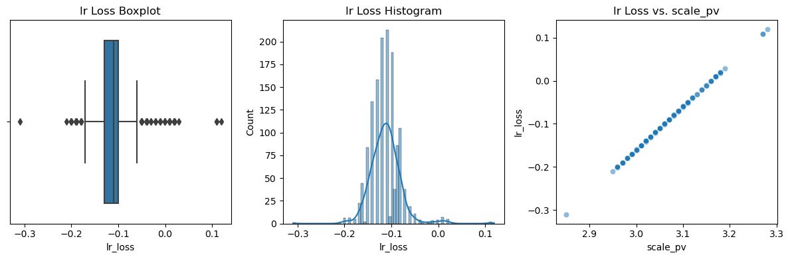

멘토링 보고용 모델 제작 결과 보고

## 1. RPM 모델 제작

**목적**: 예측된 중량값을 기준으로 RPM을 조절하는 모델 제작

### 방법 : 통계적 추론

1. 프로세스 구상

   - 1차적으로 비례관계를 가정
   - 중량과 RPM의 선형 회귀에서 기울기를 추정

2. 중량과 RPM의 상관관계 분석

  
: rpm이 170 ~ 200 사이일 때 작은 반비례 관계를 보임

3. 온도 값의 가중치를 줄여 중량값 영향력을 높임

   - 범위 지정 : 각 온도의 최빈값에서 0.2% 범위로 설정

   ```python
    # 유사한 값을 선택할 범위 설정
    tolerance = 0.2  # 적절한 범위 설정 필요

    # 평균값 계산
    c_temp_mean = data['c_temp_pv'].mean()
    n_temp_mean = data['n_temp_pv'].mean()
    s_temp_mean = data['s_temp_pv'].mean()

    # 필터링 조건 설정
    filtered_data = data[
        (data['c_temp_pv'].between(c_temp_mean - tolerance, c_temp_mean + tolerance)) &
        (data['n_temp_pv'].between(n_temp_mean - tolerance, n_temp_mean + tolerance)) &
        (data['s_temp_pv'].between(s_temp_mean - tolerance, s_temp_mean + tolerance))
    ]
   ```

4. slope : -0.05로 설정

   - -0.05g/RPM으로 설정
   - 중량이 0.05g 증가할 때마다 RPM이 1 감소

5. 상세 구성
   - 웹 구현 시 csv로 구현, 행당 0.5초
   - 첫 미팅에서 버튼 1회당 0.05g, 초당 최대 2회로 한정
   - 따라서 행당 최대 버튼 1회 가능 = 1 RPM
   - RPM 변화량 : -1, 0, 1

### 결과

---

#### RPM 제한 없을 때 : 600 이상으로 증가


#### RPM 제한 있을 때 : 200 이상으로 증가


### 결론

1. 설정 : scale이 3.05 이상일 때 rpm 변화량 = +1

2. scale_pv : 평균 3.07, 표준편차 0.006, 최소 3.06, 최대 3.10

3. rpm이 500 이상이 되어야만 3.05 이하로 내려감 (rpm_dif = 0)

4. rpm 210으로 제한 시 (실제 rpm 최대값 : 203) 210으로 고정, scale은 3.05 이하로 내려가지 않음

> 결론1) 중량 예측 모델에서 RPM의 반영 비율이 너무 작아 현실 범위에서 영향을 주지 못한다. (상관계수가 너무 낮다.)
>
> 결론2) 중량 예측의 표준편차는 0.006으로 매우 낮아, 중량 예측이 거의 일정한 값만 나오는 것을 알 수 있다.

### 분석

1. 중량 예측 모델의 편차값을 측정한 결과, 평균이 -0.1로 부정확한 수치를 보임. 사용 중인 linear regression 기준이며, random forest와 lightgbm도 동일한 오차를 보임.
   

2. 해당 모델의 성적 :
   ```python
   Final Test - Linear Regression MAE: 0.0009103039918948051, MAPE: 0.02880019210423469
   Final Test - Random Forest MAE: 0.0010451038655071077, MAPE: 0.03306669498185942
   Final Test - LightGBM MAE: 0.0009440230667424337, MAPE: 0.02986812973042499
   ```

### 문제 정의

1. 중량 예측 모델의 성능이 좋았는데, 실제 예측의 편차가 이만큼 차이나는 이유는 무엇일까요?
2. RPM과 scale의 상관관계를 높이려면 어떤 작업을 할 수 있을까요?

### 추론

1. 결과값(10월 데이터)의 편차가 작아서, 모델이 부정확해도 성능이 좋게 나오는 것으로 추측
2. VIF 확인과 PCA 적용으로 다중공선성을 줄이고, 임의로 가중치를 수정하는 방법 고안

### 중간 질의사항
1. RPM과 scale의 통계적 추론 모델 설정을 단순히 0.05 이상/이하로 했는데, 멘토님의 의견을 듣고 싶습니다.
2. 모델과 전처리별 분석 성능을 기록하고 비교하기 어려워서, 모델 분석 양식 혹은 이론을 알고 싶습니다.


## 2. VIF, PCA 확인 및 적용

VIF로 다중공선성을 확인하고, 피처 제거 및 추가하는 방법 구상

### VIF 확인 (다중공선성 확인)

1. VIF 확인 : 전체 컬럼

   ```python
   # scale 외 변수로 확인, 다중공선성이 높음
   VIF Factor	features
   0	5191.463485	c_temp_pv
   1	628.194449	k_rpm_pv
   2	7325.967704	n_temp_pv
   3	5334.673950	s_temp_pv
   ```

2. VIF : 가장 높은 n_temp_pv 제거

   ```python
   # n_temp_pv 제거 후 확인
   VIF Factor	features
    0	3775.543341	c_temp_pv
    1	616.216326	k_rpm_pv
    2	2690.773622	s_temp_pv
   ```

3. VIF : 가장 높은 c_temp_pv 제거

   ```python
   # s_temp_pv 제거 후 확인
   VIF Factor	features
    0	424.534497	k_rpm_pv
    1	424.534497	s_temp_pv
   ```

4. temp 변수만으로 확인
   ```python
   # temp 변수만으로 확인
   VIF Factor	features
   0	3659.708853	c_temp_pv
   1	7186.279513	n_temp_pv
   2	5329.484560	s_temp_pv
   ```

#### 결론

- 컬럼 제거 방법 : 가장 높은 VIF를 가진 변수를 제거하였지만 기준인 10에 미치지 못함, 다중공선성을 줄이지 못함
- PCA 방법 적용 시작

### PCA 적용

- PCA : 다중공선성을 줄이기 위해 적용
  - 적용 시 VIF = 1로 확인

```python
# 3가지 temp 만으로 PCA 적용
PCA Component Shape: (36720, 1) # n_components = 1
PCA Component: [[0.37016399 0.67372249 0.63959098]]
PCA Explained Variance: [0.56120402]
PCA Explained Variance Sum: 0.5612040219602986
```

```python
# Random Forest without PCA
X = data.drop(['scale_pv', 'PCA'], axis=1)
y = data['scale_pv']
...
--------------------------
MAE: 0.020739688478127995
MAPE: 0.6832850969599515
R2: 0.4061375618241577
==========================
 # 편차의 descriptives
diff = y_test.values - y_pred
diff = pd.Series(diff)
diff.describe()
--------------------------
count    7344.000000
mean       -0.000161
std         0.031541
min        -0.414400
25%        -0.013806
50%         0.000400
75%         0.014475
max         0.307467
dtype: float64
```

```python
# Random Forest with PCA
X = data[['PCA', 'k_rpm_pv']]
y = data['scale_pv']
...
--------------------------
MAE: 0.027692902530646185
MAPE: 0.9131137571869419
R2: -0.017669738516535638
==========================
 # 편차의 descriptives
diff = y_test.values - y_pred
diff = pd.Series(diff)
diff.describe()
--------------------------
count    7344.000000
mean       -0.000987
std         0.041277
min        -0.510600
25%        -0.020554
50%         0.000133
75%         0.019500
max         0.412600
dtype: float64
```

=> PCA 적용 시 성능이 더 떨어지고 편차도 커짐을 확인; 적용 보류

### 문제 정의

1. VIF로 다중공선성을 확인하고, PCA를 적용했지만 성능이 더 떨어지는 이유는 무엇일까요?
2. 다중공선성을 줄이기 위해 어떤 방법을 적용할 수 있을까요?

## 3. 추후 계획

### 1. 중량 예측 모델 성능 높이기

1. AutoML로 다양한 조건 적용하여 성능 확인
2. Bayesian Optimization 적용하여 하이퍼파라미터 튜닝
3. RPM 대응 함수 복잡도 높이기
4. 웹과 실시간 연동 구조 구상 (현재는 전체 csv를 출력하는 형태)

### 2. RPM 모델 성능 높이기

1. RPM과 scale의 상관관계 높이기
2. RPM 변화량 조정
3. 중량 모델에서 RPM 가중치 임의 조정


## 참고자료

  
: 상관관계 분석 : 온도간 상관관계가 높아 다중공선성이 발생함

  
: temp-PCA 적용 시 n_temp 영향을 낮춰 rpm 과의 상관관계가 미약하게 증가함을 확인

#### 전처리 과정

| 항목 | 결과 | 근거 |
| --- | --- | --- |
| Unnamed : 12 | 컬럼 제거 | 불필요한 컬럼 |
| 데이터 분할 | 10월 전후 데이터 분할| 학습 데이터와 테스트 데이터 분리 |
| E_scr_pv | E_scr_pv == 8 | 나머지 값은 설정 오류(회의 내용)|
| k_rpm_pv | 100 ~ 210 한정 | 100 이하, 210 이상은 불연속 값 |
| _sv | 제거 | scale 미반영 |
| 학습 데이터 | KNN 증강 | 데이터 확충 |
| 데이터 정규화 | StandardScaler | 낮은 표준편차 |

